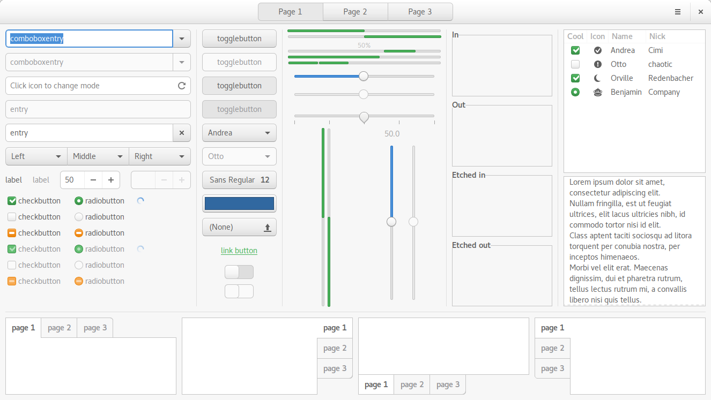

# Aduru
Yet another Adwaita derivative. This one (mostly) keeps the liberal padding and goes back to older versions of Adwaita for some of its design cues while also taking aspects of Suru/Unity 8. Very much a work in progress for now.

## Preview

## Original projects
- https://git.gnome.org/browse/gtk+/tree/gtk/theme/Adwaita/
- https://git.gnome.org/browse/gnome-themes-standard/tree/themes/Adwaita
- https://git.gnome.org/browse/gnome-shell-sass/
- https://github.com/gnome-design-team/gnome-mockups
