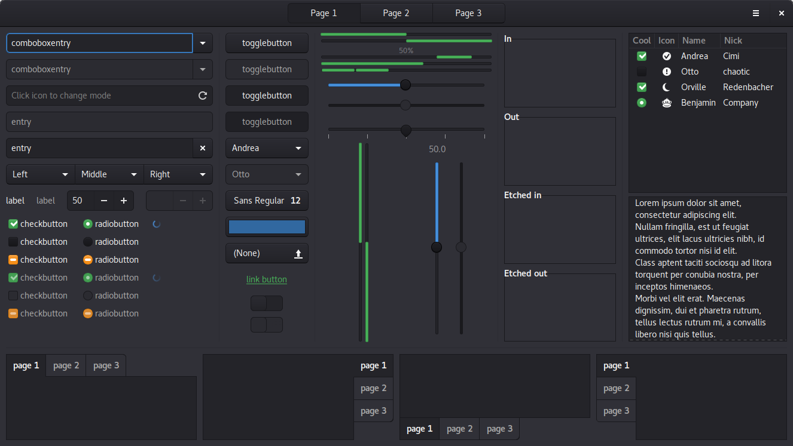

# Aduru
An Adwaita derivative that's a mishmash of some of Adwaita's older design cues and Suru/Unity 8.

## Preview

## Original projects
- https://git.gnome.org/browse/gtk+/tree/gtk/theme/Adwaita/
- https://git.gnome.org/browse/gnome-themes-standard/tree/themes/Adwaita
- https://git.gnome.org/browse/gnome-shell-sass/
- https://github.com/gnome-design-team/gnome-mockups
